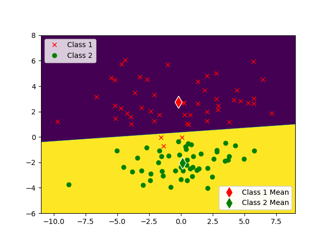
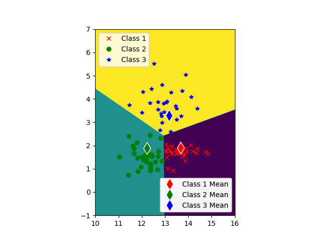
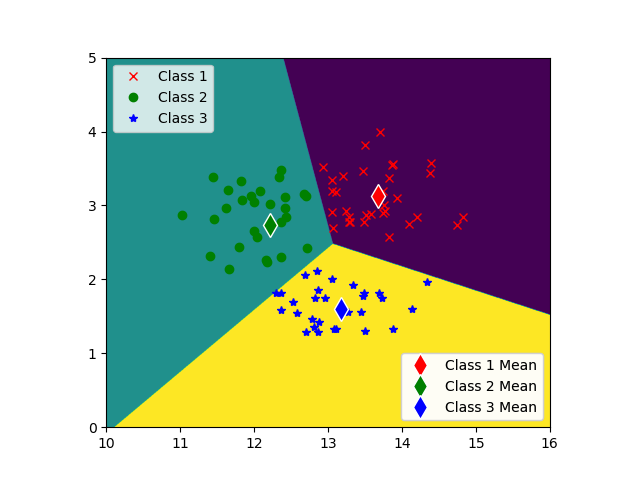

# USC-EE559-HW01  
Name: Tejas Acharya  
Class: EE-559   
Date: 14-06-2023  
Assignment: Homework 1  

OS: Linux Mint  
Distribution: Anaconda  

## Synthetic-1  
Model: Nearest Means Classifier  
Training Error Rate: 21.00%  
Test Error Rate: 24.00%  

Training Data Decision Boundary:  

Predicted Training Data Decision Boundary:  
  

## Synthetic-2  
Model: Nearest Means Classifier  
Training Error Rate: 3.00%  
Test Error Rate: 4.00%  

Training Data Decision Boundary:  

Predicted Training Data Decision Boundary:  
  

### (b)
There is a significant difference in error rates between Synthetic-1 and Synthetic-2 dataset with
Synthetic-2 showing a low error rate.
This is either due to:
* Synthetic-2 data is more separable than Synthetic-1
* NearestMeansClassifier is a poor algorithm for Synthetic-1, because when we observe y_train.png for
  Synthetic-1, the natural labelling of the class is not due to the distance from the class means.  

## Wine
Model: Nearest Means Classifier
### (c)
Training Error Rate: 20.22%  
Test Error Rate: 22.47%  

Training Data Decision Boundary:   
  

Predicted Training Data Decision Boundary:  
  
  
### (d)
Best Feature: 0, 11  
Train Error Rate(Best Feature): 7.87%  
Test Error Rate(Best Feature): 12.36%  

Training Data Decision Boundary(for best feature): 
  

Predicted Training Data Decision Boundary(for best feature):  
  

Description to find Best Feature:  
- Build a list of pairwise set of features, feature set must be unique  
- For each pairwise feature set:
    - Build a model  
    - Obtain the Prediction(y_train_predict) on Training Set(X_train)  
    - Get Train Error Rate(y_train_error_rate) for each model and Prediction  
    - Append the Train Error Rate to Train Error Rate list  
- Get the minimum element of Train Error Rate list and it's index.  

### (e)  
Standard Deviation in Train Error Rate over different pairs of Features: 12.87  
Coefficient of variation of Train Error Rate: 0.37  
With a Train CV below 1, there is not a significant difference in Train Error Rates across all features.  

Standard Deviation in Test Error Rate over different pairs of Features: 9.83  
Coefficient of variation of Test Error Rate: 0.29  
With a Test CV below 1, there is not a significant difference in Test Error Rates across all features.  