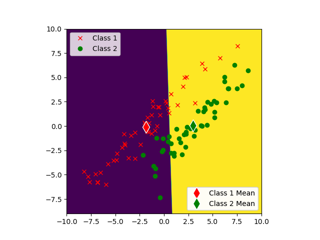
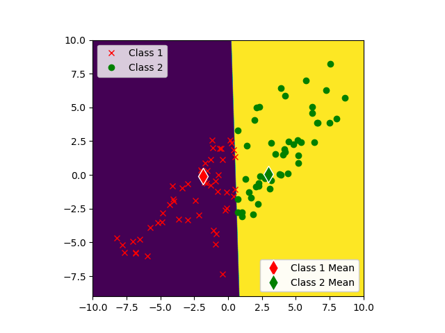

# USC-EE559-HW01  
Name: Tejas Acharya  
Class: EE-559   
Date: 14-06-2023  
Assignment: Homework 1  

OS: Linux Mint  
Distribution: Anaconda  

## Synthetic-1  
Model: Nearest Means Classifier  
Training Error Rate: 21.00%  
Test Error Rate: 24.00%  

Training Data Decision Boundary:  

Predicted Training Data Decision Boundary:  
